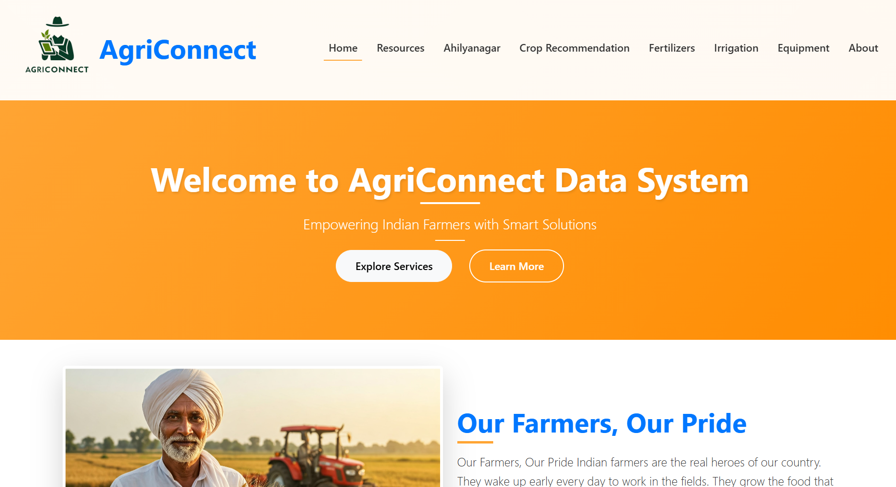

# 🌱 AgriConnect – Smart Agricultural Data System  

## 📌 Overview  
AgriConnect is a **web-based platform** designed to empower farmers with agricultural information and **AI-based crop recommendations**.  
The system helps farmers make **data-driven decisions** that improve productivity, optimize resources, and promote sustainable farming practices.  

---

## 🚀 Features  
- ✅ **Crop Recommendation System** – AI-driven suggestions based on soil, climate, and crop data.  
- ✅ **User-friendly Interface** – Built using **HTML5, CSS3, and JavaScript** for responsive design.  
- ✅ **Real-time Data Access** – Fetches agricultural insights dynamically.  
- ✅ **Farmer-centric Design** – Simple, clean, and accessible UI for rural usability.  
- ✅ **Scalable System** – Easily extendable to include weather, fertilizer, and equipment modules.  

---

## 🛠️ Tech Stack  
- **Frontend:** HTML5, CSS3, JavaScript  
- **Backend :** Python / Flask  
- **Database :** MySQL  
- **AI/ML :** Crop recommendation algorithms  

---

## 📸Home Page  
  

---

## 📂 Project Structure  
```plaintext
## 📂 Project Structure  
```plaintext
AgriConnect/
├── About/                          # About page
│   ├── about.html
│   ├── css/
│   │   └── aboutStyle.css
│   └── assets/
│       ├── images/
│       └── videos/
│
├── Equipment/                      # Equipment information pages
│   ├── equipment.html
│   ├── css/
│   │   └── equipmentstyle.css
│   └── assets/
│       └── images/
│
├── Fertilizers/                    # Fertilizer information pages
│   ├── fertilizers.html
│   ├── css/
│   └── assets/
│       └── images/
│
├── Home/                           # Homepage
│   ├── index.html
│   ├── css/
│   │   └── homestyle.css
│   └── assets/
│       └── images/
│           └── Index.png           
│
├── Irrigation/                     # Irrigation methods
│   ├── irrigation.html
│   ├── drip-irrigation.html
│   ├── sprinkler-irrigation.html
│   ├── surface-irrigation.html
│   ├── micro-irrigation.html
│   ├── furrow-irrigation.html
│   ├── center-pivot-irrigation.html
│   └── assets/
│       └── images/
│
├── .vscode/                        
│
└── README.md                       # Project documentation

